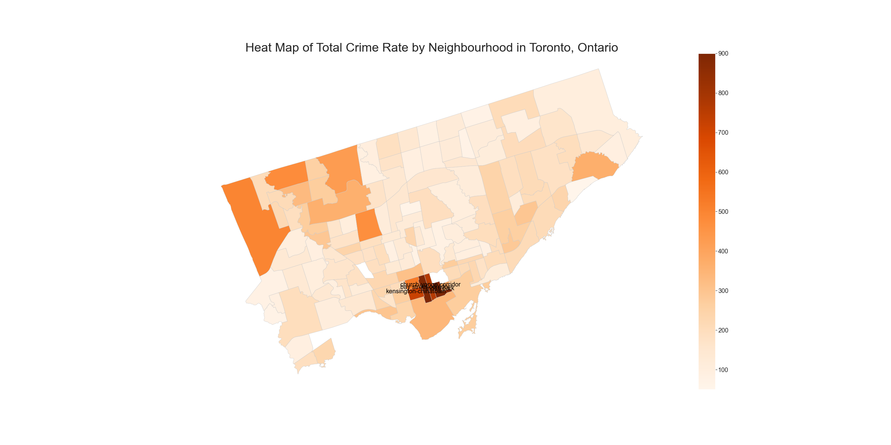
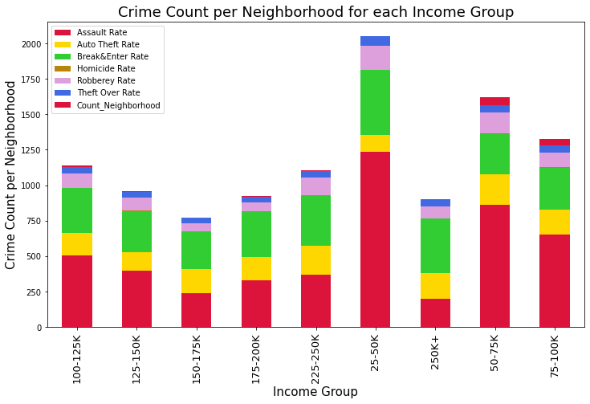

# Project-1-Crime-Demographics-and-City-Response

**Submitted By:** Dong Yi Kim | Elizabeth Salas martinez | Saif Gorges | Saloni Gupta | Sooyeon Kim  
_Date_: november, 12th, 2020\
ETL - **Crime-Demographics-and-City-Response**  

## Introduction
It might be a challenge to choose where to live in Toronto when you decide to move or open a business. In this project, we built a database that demonstrated the crime rate, income range, house prices, and population of the neighbourhoods. We wanted to find this information about each neighbourhood and if there are correlations between those measures. We also wanted to look at if those kinds of measures affect the Starbucks locations so that we know what real business consider most when they choose the locations. Our main assumptions were that maybe there is a negative correlation between income/house prices and crime rates, and the average income of neighbourhoods will affect the Starbucks locations. We will also be looking at how the city responds to crime rates in Toronto.

## Data Extraction
In this project we extracted, transformed, and loaded different types of datasets as Income, Crime, Rental House Prices, Red Light Camers, Speeding Count and Starbucks locations.

- Our main sources:
 - Toronto Neighbourhood Data - Toronto City Open Data
 - Toronto Neighbourhood Income - Toronto City Open Data
 - Toronto Crime Data - Toronto City Open Data
 - Toronto House Price - Toronto City Open Data
 - Red Light Cameras - Kaggle
 - Speeding Count - ArcGIS API
 - Starbucks Locations - Kaggle

- We make an API call on

## Data Engineering  

  

## Data Transformation
- We used a Pandas functions in Jupyter Notebook to transform all CSV files, scraped data, and API request responses.
- We reviewed the files and transformed into a dataframes.
- We used a python transformation functions for data cleaning, joining, filtering, and aggregating.
- Several columns removed
- Duplicate rows was removed, and successfully managed.
- We conducted some aggregation to find totals for comparison in the datasets.

## Load

- Income Table
- Crime Table
- Starbucks Table
- Red Light Cameras Table
- Speeding Table
- House Rental Prices Table

## Analysis and Insights

Questions answered:-  
* **Which areas in Toronto have high average income?**  
  * Answer: Midtown Neighbourhoods (i.e. Bridle Path-Sunnybrook-York Mills, Lawrence Park South)  

  

- **Which areas in Toronto have high crime rates?**  
  * Answer: Downtown & Northwest (i.e. Bay Street Corridor, Church-Yonge Corridor, Kensington-Chinatown)  
  

- **Are there more red light cameras in lower income regions?**  

- **How does crime rate vary for neighborhoods in different  Income Range?**  
  
  

- **Is there a higher crime rate in lower income regions?**  

- **Is there a correlation between house prices and crime rates?**  
  

- **Are there more Starbucks locations in higher income neighborhoods?**  
  

#### Crime Rate and Income Correlation  
There's a negative correlation between Average Crime Rate and Average Income.  
Low Income area has higher crime rate.  
R value -> negative relationship.  
p-value<0.005 -> A statistically significant test result  
The stacked bar graph shows Crime Count per neighborhood for each Income Group which depicts lower income regions have higher crime rate per neighborhood. 
#### Red Light Cameras Analysis  
From the graphs above, we can see that the majority of red light cameras are implemented in regions with an average income of 50-100K. Comparing this with the total number of speeding tickets per income region we see that the same income region holds the most amount of speeding tickets. We can conclude from this that red light cameras are not necessarly placed in low income regions, but more-so regions where speeding is more commonplace.  
#### House Prices and Crime Rate  
It seems that there is a very weak negative correlation between crime rate and house prices. 
#### Starbucks Locations Analysis  
The Number of Starbucks Stores vs. Average Income scatter plot shows that it seems that there is no correlation between starbucks stores location and income.  
#### Heat Maps Analysis
* Looking at the heat map of Average Income by Neighbourhood, it seems that midtown neighbourhoods generally have higher average income, and Downtown and Northwest tend to have higher crime rate. 
* Seeing the heat map of Crime Rate by Neighbourghood, it seems that downtown and northwest areas tend to have higher crime rates. 
* The heat map of the number Starbucks stores by neighbourhood in Toronto shows stores are significantly concentrated in downtown area. Especially, in one neighbourhood called ‘Bay Street Corridor’, there are 26 stores. We can assume that foot traffic than the average income would be a more important factor for Starbucks Locations. In other words, neighbourhoods where there are a lot of offices and businesses tend to have more stores.

## Technologies
Project is created with:

* Python 3.8
* Jupyter Notebook
* Pandas
* Matplotlib
* ArcGIS API
* GeoPandas
